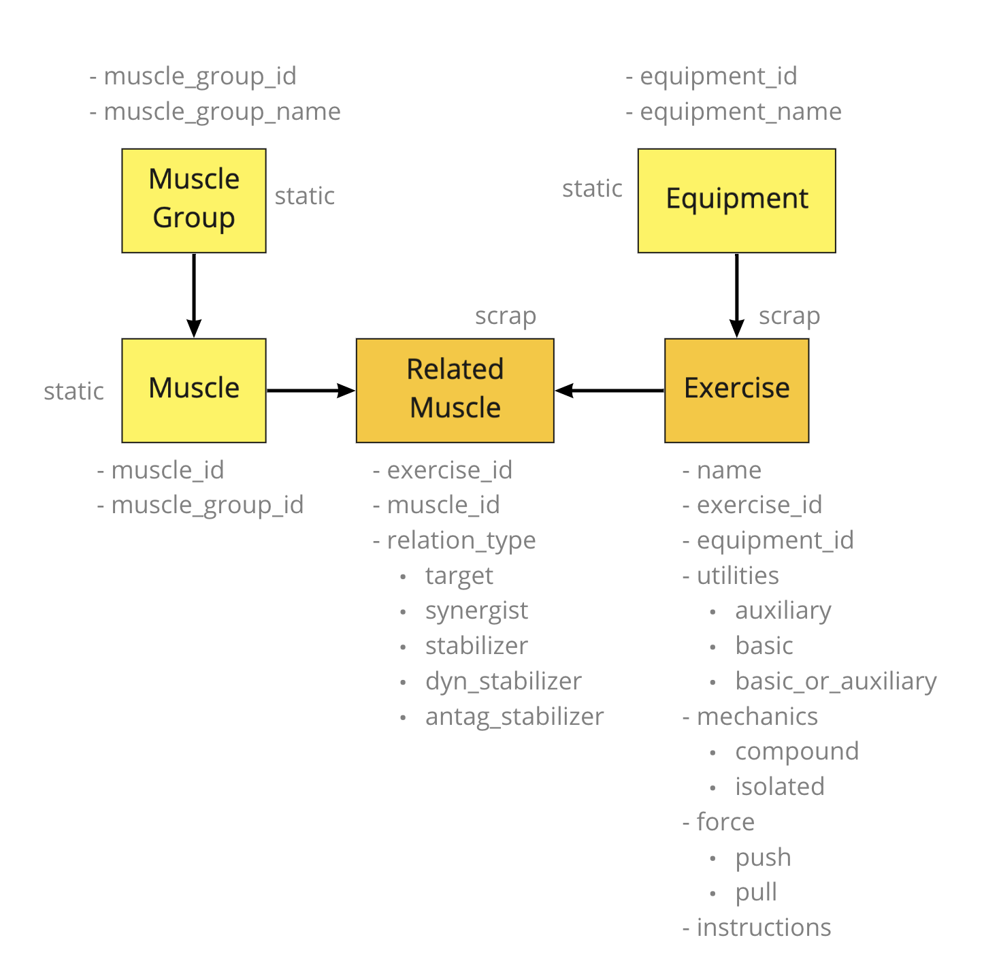

# exrx-loader

Exrx.net exercise database scrapper.

We tried to get the best of the great structure from the website [Exrx](https://exrx.net) and store it in a relational database, so it can be manipulated and enriched in other applications.

## Design

### Model

Source: https://miro.com/app/board/o9J_l9T9uF8=/

### Scrape path

* Open each MuscleGroup page (ex: https://exrx.net/Lists/ExList/NeckWt)
  * Discover all exercises in MuscleGroup page by url
    * URL format is "/WeightExercises/(muscle_name)/(two_letter_equipment_initials)(exercise_name)"
  * Collect exercise URL, muscle, equipment_initials and exercise_name
  * For each exercise
    * Get from page: display_name, instructions_preparation, instructions_execution, instructions_comments, muscles_target, muscles_synergists, muscles_stabilizers, muscles_dynstabilizers, muscles_antagonist_stabilizers, utility, mechanics, force and video_url
    * Add info URL, exercise_name and equipment_initials from previous step

### Sample SQL queries

* SELECT id, name, count(*) AS c FROM 'exercise' INNER JOIN 'muscle_exercise' ON muscle_exercise.exercise_id=exercise.id GROUP BY id, name ORDER BY c DESC

* SELECT * FROM 'muscle_exercise' where exercise_id='CBOneArmHighRow'

* select equipment_id,count(*) as c from exercise group by equipment_id order by c desc

